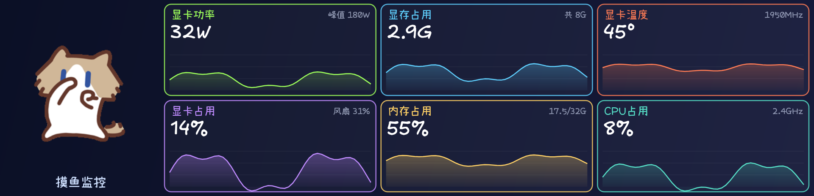
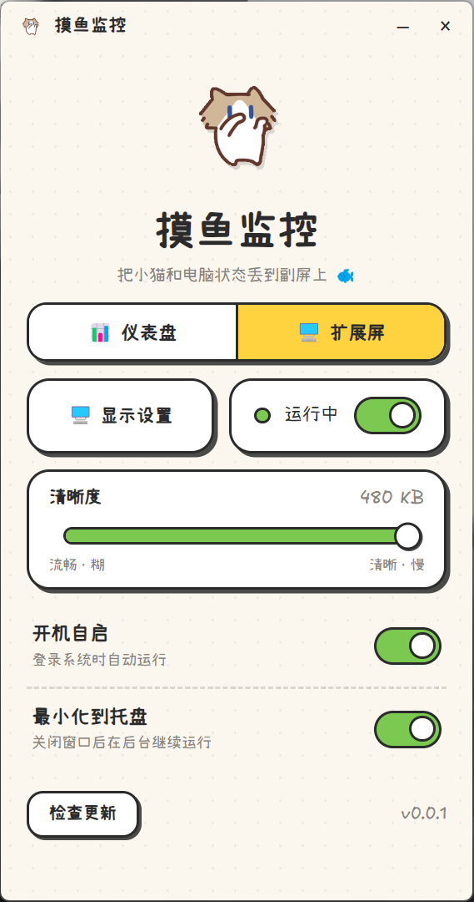

<div align="center">
  

  <h1>摸鱼监控</h1>

  <h3>把「月薪喵」和电脑状态，一起丢到桌上的副屏里。</h3>
  <p>一块手绘风的硬件仪表盘 —— 左边是会动的小猫，右边是 GPU / 内存 / CPU 的实时曲线，<br/>全部画在 TURZX 8.8 寸 USB 长条屏上。</p>

  <p>
    
    
    
    
  </p>
</div>

<br />

<div align="center">
  
  <p><sub>副屏上的实际画面（长条屏是竖着的，程序会自动把横版画面旋转 90°）</sub></p>
</div>

<br />

摸鱼监控是一个很小的桌面程序。它把一只手绘风的小猫和你电脑的硬件状态，一起画到 TURZX 那块 8.8 寸的 USB 副屏上 —— 这样你一边干活（或者摸鱼 🐟），一边就能瞄一眼显卡功率、显存、温度、内存和 CPU 占用。全部由一个开源的 Node 驱动直接点亮屏幕，**不需要装 TURZX 官方软件**。

整套界面都是手绘的：Excalifont 手写字体、暖色背景、任务管理器那样的抖动曲线，还有一只眼里含泪、努力打工的月薪喵。

## 功能特性

- 🐱&nbsp;&nbsp;**会动的月薪喵** —— 小猫动画循环播放，陪你一起上班。
- 📊&nbsp;&nbsp;**实时硬件曲线** —— 显卡功率 / 显存 / 温度 / 占用 + 内存 + CPU，全是任务管理器风格的折线图。
- 🎨&nbsp;&nbsp;**处处手绘** —— Excalifont + 小赖字体，暖色纸张配色。
- 🖥️&nbsp;&nbsp;**一键投屏** —— 开源 USB 驱动直接驱动 TURZX 面板，无需官方软件。
- 🪟&nbsp;&nbsp;**小巧的控制面板** —— 启动 / 停止、开机自启、最小化到托盘、检查更新，就这么几个按钮。
- 🔌&nbsp;&nbsp;**纯本地** —— 数据只在你自己电脑上读，不联网（除了你主动点「检查更新」）。

## 运行需要什么

- **一块 TURZX 8.8 寸 USB 副屏**（`VID 0x1CBE / PID 0x0092`），用 USB 插好。
- **运行时请关闭 TURZX 官方软件** —— 它会独占 USB 设备，不关就连不上。
- **NVIDIA 显卡 + 驱动自带的 `nvidia-smi`** —— 用来读显卡功率 / 温度 / 显存 / 风扇等。装了 N 卡驱动一般 PATH 里就有；没有 N 卡也能跑，只是显卡那几块没数据。
- **内存 / CPU 数据** —— 由 [`systeminformation`](https://www.npmjs.com/package/systeminformation) 读取，无需额外安装。
- **ffmpeg** —— 已随应用打包（[`@ffmpeg-installer/ffmpeg`](https://www.npmjs.com/package/@ffmpeg-installer/ffmpeg)），用来把 `cat.GIF` 拆成帧，**你不用自己装**。
- 安装包是 **64 位 Windows（x64）**。

## 怎么用

### 普通用户（推荐）

到 [Releases](../../releases) 下载 `meow-monitor-x.y.z-setup.exe`，装好后打开「摸鱼监控」：插上副屏 → 关掉官方软件 → 点 **启动**。搞定。

> 安装包没有做代码签名，Windows SmartScreen 可能会拦一下，点「更多信息 → 仍要运行」即可。

### 开发 / 自己打包

本程序基于 **Electron**，引擎部分是纯 Node.js。

```bash
npm install          # 安装依赖
npm run icon         # 从 cat.GIF 第一帧生成应用图标（仓库里已带，可跳过）
npm start            # 打开控制面板（Electron）
npm run dist:win     # 打包成 Windows x64 安装程序，输出在 dist/
```

不想开界面，也可以直接命令行把仪表盘投到副屏：

```bash
npm run monitor          # 直接运行引擎，Ctrl+C 停止
FPS=20 npm run monitor   # 调整目标帧率（面板约 14~15 fps 封顶）
```

## 控制面板里的按钮

<div align="center">
  
</div>

| 按钮 | 作用 |
| --- | --- |
| **启动 / 停止** | 开始 / 结束把小猫和仪表盘投到副屏。 |
| **显示设置** | 打开windows显示设置界面。 |
| **清晰度** | 调整扩展屏模式下的扩展屏分辨率。 |
| **开机自启** | 登录系统时自动启动「摸鱼监控」。 |
| **最小化到托盘** | 开启后，关闭窗口不退出程序，而是缩到托盘继续在后台运行。 |
| **检查更新** | 读取本仓库的 GitHub Releases，有新版本就提示你去下载。 |

## 它是怎么工作的

面板走的是它的**图片通道**：先进入图片模式（USB 命令 `0x33` mode 1），再把每一帧当 **PNG** 用命令 `0x66` 推上去。画面在面板原生的 **464×1920** 分辨率下绘制（横版内容旋转 90°），小猫在左、指标在右。换动画只要替换 `assets/cat.GIF`，程序会用 ffmpeg 自动重新拆帧。

完整的协议逆向过程见 [docs/PROTOCOL.md](./docs/PROTOCOL.md)。

```
assets/cat.GIF        小猫动画（月薪喵）
fonts/                Excalifont（英文/数字）+ 小赖（中文）
src/turzx.js          点亮面板的开源 USB 驱动
src/des.js            协议用到的 DES-CBC 实现
src/metrics.js        nvidia-smi + systeminformation 采集硬件指标
src/dashboard.js      把小猫 + 指标曲线渲染成一帧
src/monitor.js        引擎：循环渲染并推送到副屏（可被界面控制，也能单独跑）
electron/             小巧的控制面板（界面 + 托盘 + 自启 + 更新检查）
docs/PROTOCOL.md      面板协议是怎么逆向出来的
```

## 致谢与引用

这个项目是踩在很多开源成果的肩膀上拼出来的，特别感谢：

- 🖥️&nbsp;&nbsp;屏幕驱动与协议逆向，基于开源项目 **TURZX**（本仓库 `src/turzx.js` 与 [docs/PROTOCOL.md](./docs/PROTOCOL.md)）。
- 🐱&nbsp;&nbsp;小猫「**月薪喵 / SalaryCat**」来自 [Einswen/SalaryCat](https://github.com/Einswen/SalaryCat)。
- ✍️&nbsp;&nbsp;手写字体 **Excalifont** 来自 [excalidraw/excalidraw](https://github.com/excalidraw/excalidraw)。

以上第三方素材与字体的版权、许可均归各自原作者所有，使用时请遵循它们各自的开源协议。

## 许可证

本项目自身的代码以 [MIT](./LICENSE) 开源；引用到的第三方组件（月薪喵、Excalifont、TURZX 等）遵循其各自的许可证。
